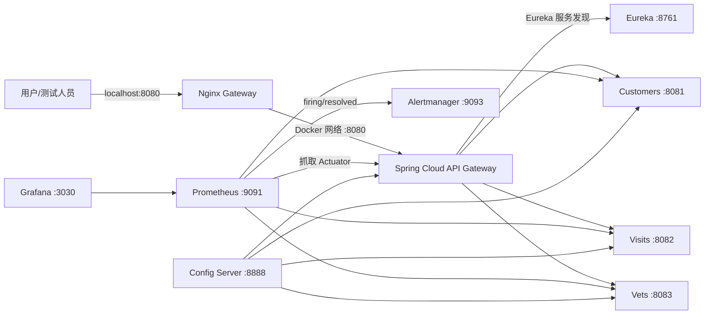

# Spring Petclinic 运维作品说明

## 项目定位

本项目基于开源项目
[`spring-petclinic/spring-petclinic-microservices`](https://github.com/spring-petclinic/spring-petclinic-microservices)
进行运维增强。上游负责 Spring Boot/Spring Cloud 业务代码；本人负责本仓库中新增的入口治理、端口隔离、健康检查、监控告警、恢复轮询和故障演练，不将上游业务开发表述为个人成果。

一句话成果：为多容器微服务增加统一入口、最小化宿主机暴露面、可重复健康检查和 `Prometheus -> Alertmanager` 告警链路，并用 Customers 服务停机演练验证发现、定位、恢复和 RCA 全流程。

## 运维架构



Customers、Visits、Vets 和 API Gateway 只通过 Compose 内部网络提供业务端口。`8080` 是用户访问业务的统一入口；Eureka、Prometheus、Grafana 和 Alertmanager 仍作为本地运维管理入口映射到宿主机，尚未增加生产级认证和 TLS。

## 本人实现

| 能力 | 实现 | 已验证结果 |
| --- | --- | --- |
| 统一入口 | Nginx 反向代理 API Gateway，增加 `/nginx-health` 和上游日志字段 | 健康接口与业务首页 HTTP 200，日志记录真实 upstream |
| 网络收敛 | Customers、Visits、Vets 改为 `expose`，取消宿主机业务端口映射 | 8081-8083 从宿主机不可达，Gateway 与 Prometheus 内部访问正常 |
| 自动验收 | PowerShell 检查 Nginx、业务接口、端口隔离和 Prometheus Targets | 9 项检查全部 `PASS`，成功/失败退出码为 0/1 |
| 故障演练 | 主动停止 Customers，采集 Gateway、服务和 Prometheus 证据 | 识别静态首页 200 的浅层检查盲区，完成 RCA 和恢复验证 |
| 告警规则 | `PetclinicServiceDown` 检测三个核心服务 `up == 0` 持续 30 秒 | 验证 `inactive -> firing -> inactive` 生命周期 |
| 告警路由 | Prometheus 将告警发送至 Alertmanager `operations` 接收器 | 验证连接、活动告警投递、分组和恢复清除 |
| 恢复验收 | 每 5 秒联合轮询业务 API、Eureka 和 Prometheus，最长 300 秒 | 信号就绪后自动执行完整 9 项检查，避免单指标误判恢复 |

## 快速验证

```powershell
# 立即检查当前状态，任何失败返回退出码 1
powershell -ExecutionPolicy Bypass -File .\scripts\ops\verify-stack.ps1

# 检查 Prometheus 告警规则状态
powershell -ExecutionPolicy Bypass -File .\scripts\ops\verify-alert-rule.ps1 `
  -ExpectedState inactive

# 检查 Alertmanager 连接和活动告警
powershell -ExecutionPolicy Bypass -File .\scripts\ops\verify-alertmanager.ps1 `
  -ExpectedAlert absent

# 服务恢复时轮询 API、Eureka 和 Prometheus，随后执行完整检查
powershell -ExecutionPolicy Bypass -File .\scripts\ops\wait-stack-ready.ps1 `
  -WaitSeconds 300 `
  -PollIntervalSeconds 5
```

## 操作文档

- [Nginx 统一入口](nginx-entry.md)
- [自动健康检查](health-check.md)
- [Customers 故障演练](customer-service-failure-drill.md)
- [Prometheus 服务下线告警](prometheus-service-alert.md)
- [Alertmanager 告警链路](alertmanager-integration.md)

## 当前边界

- 环境在 Windows Docker Desktop 上完成验证，不表述为生产 Linux 运维经验。
- Alertmanager 已完成本地路由验证，尚未配置邮件、钉钉或企业微信等外部通知渠道。
- 尚未完成 MySQL 持久化、备份和恢复演练。
- 运维管理入口尚未配置鉴权、TLS、访问控制和生产级高可用。
- 尚未进行压力测试、容量评估和长期稳定性验证。
