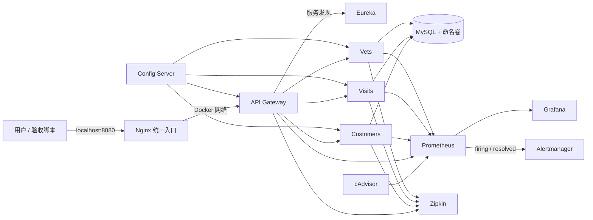

# Spring Petclinic 运维增强作品

## 项目定位与责任边界

本仓库基于开源项目
[`spring-petclinic/spring-petclinic-microservices`](https://github.com/spring-petclinic/spring-petclinic-microservices)
进行运维增强。上游社区负责 Spring Boot / Spring Cloud 业务代码和原始微服务架构；本 Fork 中新增的入口治理、Compose 网络与数据层、运维脚本、监控告警、故障演练、安全收紧和运维静态 CI 为候选人完成。

本项目证明的是：能够接手已有应用，识别部署、观测和恢复缺口，完成改造并留下可重复验证的证据。当前运行环境是 WSL2 与 Docker Desktop，不表述为生产 Linux 运维经验，也不声称已经实现高可用、零停机或完整容灾。

## 一句话成果

将原有微服务整理为一个拥有统一入口、内部服务隔离、MySQL 持久化与恢复验证、容器资源看板、告警闭环、真实 Trace、故障演练和自动验收的本地运维作品。

## 最终架构



外部业务流量只从 Nginx 的 `8080` 进入。API Gateway、Customers、Visits 和 Vets 不向宿主机发布业务端口；它们仍可在 Compose 内部网络中进行路由、服务发现和监控采集。管理端口只绑定 `127.0.0.1`，但本地演示环境尚未配置生产级认证、TLS 或高可用。

## 本人实现与可核验结果

| 能力 | 实现 | 已验证结果 | 主要证据 |
| --- | --- | --- | --- |
| 统一入口 | Nginx 代理 API Gateway，增加独立健康接口和 upstream 日志 | `/nginx-health` 与真实业务接口均为 HTTP 200 | [`nginx-entry.md`](nginx-entry.md)、[`nginx.conf`](../../docker/nginx/nginx.conf) |
| 网络收敛 | Gateway 和三个业务服务只使用 `expose` | 宿主机 `8081—8083` 不可直连，内部路由与采集正常 | [`docker-compose.yml`](../../docker-compose.yml)、[`verify-stack.ps1`](../../scripts/ops/verify-stack.ps1) |
| 自动验收 | PowerShell 与 Bash 检查入口、业务、端口隔离和监控 Targets | 健康场景九项 PASS 且退出 `0`；故障场景继续检查后退出 `1` | [`health-check.md`](health-check.md)、[`verify-stack.sh`](../../scripts/ops/verify-stack.sh) |
| 分层恢复 | 每 5 秒联合轮询业务 API、Eureka 和 Prometheus，最长 300 秒 | 多信号一致后再执行完整九项检查 | [`wait-stack-ready.ps1`](../../scripts/ops/wait-stack-ready.ps1) |
| 数据持久化 | MySQL 命名卷、健康检查、有序初始化和内部连接 | 只重建 MySQL 容器后，唯一 Owner 记录仍可读回 | [`verify-mysql-persistence.ps1`](../../scripts/ops/verify-mysql-persistence.ps1) |
| 备份恢复 | `mysqldump`、关键 SQL 检查、SHA-256、独立测试表删除后恢复 | 相同唯一标记恢复成功，随后业务、注册、监控和九项检查通过 | [`backup-mysql.ps1`](../../scripts/ops/backup-mysql.ps1)、[`verify-mysql-restore.ps1`](../../scripts/ops/verify-mysql-restore.ps1) |
| 服务告警 | `PetclinicServiceDown` 与 Alertmanager `operations` 路由 | 验证 `inactive -> firing -> inactive`，活动告警能够投递和清除 | [`prometheus-service-alert.md`](prometheus-service-alert.md)、[`alertmanager-integration.md`](alertmanager-integration.md) |
| 容器监控 | cAdvisor、Prometheus 与 Grafana 四类资源面板 | CPU、内存、网络接收和发送均返回具名容器序列 | [`verify-container-metrics.ps1`](../../scripts/ops/verify-container-metrics.ps1)、[`container-resource-dashboard.json`](../../docker/grafana/dashboards/container-resource-dashboard.json) |
| CPU 演练 | 独立测试容器限制 `0.5 CPU / 64 MiB / 300秒` | 当次约 `50.93%`，告警进入 Firing 后恢复，测试容器退出 `0`，业务复验通过 | [`alerts.yml`](../../docker/prometheus/alerts.yml) |
| 调用链追踪 | 修复 Spring Boot 4 Zipkin endpoint 覆盖并发送真实业务请求 | 捕获包含 Gateway、Customers 和 MySQL 操作的 `28 Span` Trace | [`verify-zipkin-trace.sh`](../../scripts/ops/verify-zipkin-trace.sh) |
| 最小安全收紧 | Grafana 匿名角色由 Admin 降为 Viewer；管理端口绑定本机 | 匿名写权限消失，已运行管理服务仅从本机访问 | [`grafana.ini`](../../docker/grafana/grafana.ini)、[`docker-compose.yml`](../../docker-compose.yml) |
| 运维静态 CI | 检查 Compose、Prometheus、Bash、PowerShell 和本地文档链接 | 原有提交 `dfece69` 的基础检查在线成功；扩展检查已在本地通过，待新提交触发在线复验 | [`ops-static-checks.yml`](../../.github/workflows/ops-static-checks.yml)、[`ci-static-checks.sh`](../../scripts/ops/ci-static-checks.sh)、[`verify-repository-assets.ps1`](../../scripts/ops/verify-repository-assets.ps1) |

## 快速开始

完整的新用户启动步骤位于仓库顶层 [README](../../README.md#operations-quick-start)。最短验收流程如下。

### 1. 创建本地环境文件

```powershell
Copy-Item .env.example .env
notepad .env
```

必须替换两个示例数据库密码。`.env` 已加入 `.gitignore`，不得提交。

### 2. 静态校验并启动核心栈

```powershell
docker compose config --quiet
docker compose up -d --wait --wait-timeout 300 `
  mysql config-server discovery-server `
  customers-service visits-service vets-service `
  api-gateway nginx-gateway tracing-server `
  alertmanager cadvisor prometheus-server grafana-server
```

`genai-service` 不在核心验收范围内；只有在单独配置 AI 服务密钥后才启动。

### 3. 执行九项验收

PowerShell：

```powershell
powershell -ExecutionPolicy Bypass -File .\scripts\ops\verify-stack.ps1
```

Bash / WSL：

```bash
bash scripts/ops/verify-stack.sh
```

成功标准是九项全部显示 `PASS`，进程退出码为 `0`。

### 4. 本地入口

| 用途 | 地址 |
| --- | --- |
| 统一业务入口 | <http://localhost:8080> |
| Nginx 健康接口 | <http://localhost:8080/nginx-health> |
| Eureka | <http://localhost:8761> |
| Grafana | <http://localhost:3030> |
| Prometheus | <http://localhost:9091> |
| Prometheus Targets | <http://localhost:9091/targets> |
| Alertmanager | <http://localhost:9093> |
| Zipkin | <http://localhost:9411/zipkin/> |

### 5. 安全停止

```powershell
docker compose stop
```

不要执行 `docker compose down -v`，除非明确需要销毁 MySQL 命名卷及其中数据。

## 故障与恢复证据导航

- [`customer-service-failure-drill.md`](customer-service-failure-drill.md)：Customers 停服、检查失败、日志定位、恢复与 RCA。
- [`prometheus-service-alert.md`](prometheus-service-alert.md)：服务下线规则和状态生命周期。
- [`alertmanager-integration.md`](alertmanager-integration.md)：告警路由、分组、活动告警与恢复清除。
- [`verify-mysql-persistence.ps1`](../../scripts/ops/verify-mysql-persistence.ps1)：容器重建后的数据持久化验证。
- [`verify-mysql-restore.ps1`](../../scripts/ops/verify-mysql-restore.ps1)：独立测试表的备份、删除、恢复和全栈复验。
- [`verify-container-metrics.ps1`](../../scripts/ops/verify-container-metrics.ps1)：cAdvisor Target 与三类容器指标验证。
- [`verify-grafana-container-dashboard.ps1`](../../scripts/ops/verify-grafana-container-dashboard.ps1)：Grafana 看板自动加载和真实序列验证。
- [`verify-zipkin-trace.sh`](../../scripts/ops/verify-zipkin-trace.sh)：真实业务 Trace 与全栈联合验收。

## 运维方法

本项目不使用单一信号判断服务状态：

1. 入口健康只说明 Nginx 能响应。
2. 首页 HTTP 200 不代表下游业务服务可用。
3. 容器 `Started` 不代表已注册、可路由或已被监控采集。
4. 恢复需要业务 API、Eureka 和 Prometheus 多个信号一致。
5. 备份需要通过删除后恢复验证，而不是只检查文件存在。
6. 故障演练必须限制影响范围，并在结束后执行完整栈复验。

## 当前边界

- 所有证据来自 WSL2 与 Docker Desktop 本地环境，不等同生产 Linux 服务器经验。
- MySQL 是单实例，未实现复制、GTID、自动故障转移或基于 Binlog 的时间点恢复。
- `76秒` 是一次小数据量恢复演练快照，不是生产 RTO；RPO 也未在本项目中承诺。
- CPU 演练数据只证明指标与告警链路有效，不代表业务容量。
- 管理端口虽限制到本机，但尚未完成 TLS、统一认证、可信代理、WAF 或 Nginx 高可用。
- Alertmanager 已验证本地路由，尚未接入邮件、企业微信或其他外部通知渠道。
- GitHub Actions 当前执行静态检查；扩展后的PowerShell和文档检查需在新提交推送后取得在线成功证据。流水线不包含镜像发布、环境部署、灰度或自动回滚。
- 尚未进行接近生产数据量的压力测试、容量评估和长期稳定性测试。

## 安全与清理规则

- 不提交 `.env`、数据库密码、API Key、私钥或生成的数据库备份。
- 不在文档和脚本中写入个人电脑绝对路径。
- 不在普通停止或重建流程中使用 `docker compose down -v`。
- 公开结果只描述已经通过脚本、日志、页面或 GitHub Actions 核验的事实。
